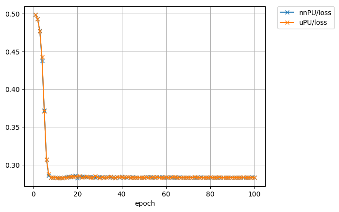
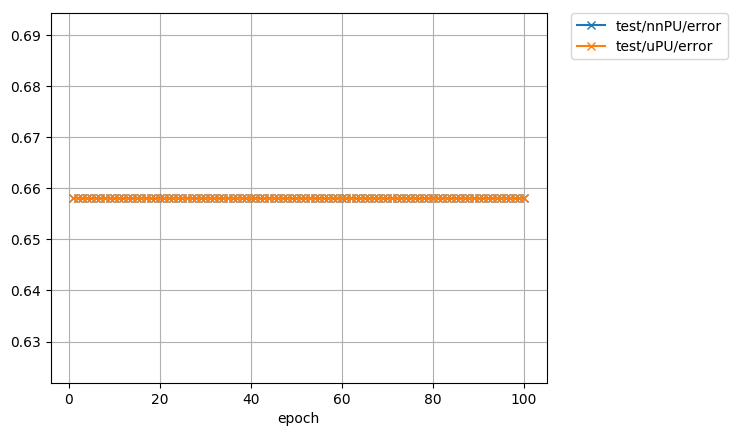

# Chainer implementation of non-negative PU learning and unbiased PU learning
This is a reproducing code for non-negative PU learning [1] and unbiased PU learning [2] in the paper "Positive-Unlabeled Learning with Non-Negative Risk Estimator".

* ```pu_loss.py``` has a chainer implementation of the risk estimator for non-negative PU (nnPU) learning and unbiased PU (uPU) learning. 
* ```train.py``` is an example code of nnPU learning and uPU learning. 
Dataset are MNIST [3] preprocessed in such a way that even digits form the P class and odd digits form the N class and
CIFAR10 [4] preprocessed in such a way that artifacts form the P class and living things form the N class.
The default setting is 100 P data and 59900 U data of MNIST, and the class prior is the ratio of P class data in U data.

## Requirements
* Python 3
* Numpy >=1.1
* Chainer >=2.0
* Scikit-learn 0.18

## Quick start
You can run an example code of MNIST for comparing the performance of nnPU learning and uPU learning on GPU.

    python3 train.py -g 0

There are also preset configurations for reproducing results on [1].
* ``--preset figure1``: The setting of Figure 1
* ``--preset exp-mnist``: The setting of MNIST experiment in Experiment
* ``--preset exp-cifar``: The setting of CIFAR10 experiment in Experiment

You can see additional information by adding ```--help```.

## Example result
After running ```training_mnist.py```, 2 figures and 1 log file are made in ```result/``` by default.
* Training error in ```result/training_error.png```



* Test error in ```result/test_error.png```



## Reference

[1] Ryuichi Kiryo, Gang Niu, Marthinus Christoffel du Plessis, and Masashi Sugiyama. 
"Positive-Unlabeled Learning with Non-Negative Risk Estimator." Advances in neural information processing systems. 2017.

[2] Marthinus Christoffel du Plessis, Gang Niu, and Masashi Sugiyama. 
"Convex formulation for learning from positive and unlabeled data." 
Proceedings of The 32nd International Conference on Machine Learning. 2015.

[3] LeCun, Yann. "The MNIST database of handwritten digits." http://yann.lecun.com/exdb/mnist/ (1998).

[4] Krizhevsky, Alex, and Geoffrey Hinton. "Learning multiple layers of features from tiny images." (2009).

======HSI segmentation part=====================================================================================================================
To run on Indian pines data follow the steps:

Follow them sequentially

1) Install brew, wget with brew(brew install wget --with-libressl), python3 and pip3, create a virtualenv,  install all dependencies using pip3(in the virtualenv) from requirements.txt

2) run the command to preprocess the data
    python3 preprocessing_indian_pines.py

3) create db using the following command
    python3 schema.py

TESTS:

There are two types of tests using BASSNet + PU learning
Type 1:

Positive Class: A positive class labels is selected from a list, randomly some pixels are selected from that class for training

Negative Class: From a list of negative class labels, randomly some pixels are selected from that class for training

Testing and Training Data: The two types of data are non-overlapping

Parameters to tune:

File : run_type1_test.py

A) train_pos_percentage : Percentage of pixels from total pixels of positive class that will be included in training, 60% of training positive pixels will be labelled in PU learning

Ex: According to groundtooth image for class label k no of pixels  = 1057
train_pos_percentage = 30
then randomly (1057 * 30)//100 = 317 pixels will be selected for PU training out of which 190 pixels will be labelled and rest 127 unlabelled, rest 740 pixels will be used for testing

B) train_neg_percentage : Percentage of pixels from total pixels of negative class list (include_class_list - positive_class) that will be included in training

Ex: According to groundtooth image for negative class labels list [ i, j ] total no of pixels  = 2078
train_neg_percentage = 30
Then according to the value of is_random_neg parameter(described below) 30 percent of 2078 i.e 623 pixels will be selected for training as unlabelled data and rest for testing

C) include_class_list : Class label list included in this test, negative class list = list(set(include_class_list) - set(positive_class))

Ex include_class_list = [2, 3, 5, 6, 8, 10, 11, 12, 14]
Then each item in include_class_list will be considered as positive label and rest as negative label,
When class label 2 is considered as positive class then negative class labels list is [3, 5, 6, 8, 10, 11, 12, 14]
Note: Class labels should be present in groundtooth image

D) is_random_neg : Boolean value to indicate the way of selection for negative unlabelled training data,
If set to true then all the data from negative class list are accumulated and randomly train_neg_percentage of the total data is selected
In the above case it might happen that training data might not have any pixel for class k in negative class list
If set to false then train_neg_percentage pixels of data is randomly selected for each class in negative class list
The above ensures that training data has some pixels of each class in negative class list

E) gpu : Zero-origin GPU ID (negative value indicates CPU)

Note: For every test the coressponding output is saved in DB. If you want to rerun a test for the same combination of
 (positive class, negative labels list, test type) then delete the entry from PUstats.

To run the tests, tune the above parameters and run the following command:

python3 run_type1_test.py

Type 2:
Positive Class: A positive class labels is selected from a list, spatially closely related pixels are selected from that class for training.
For a class label j selected as a positive class, a square patch of size k * k is selected which has minimum percnt_pos(described below) pixels of the postive class.
To get the value of k for a class label j we need to do some preprocessing

Negative Class: From a list of negative class labels, all pixels are selected from that class for training

Testing and Training Data: The two types of data are fully-overlapping

Parameters to tune:

File : type2_patch.py
percnt_pos : Minimum percentage of total positive pixels that should be present in the patch

Ex: percnt_pos = 30
For every class [1,2...n] present in the groundtooth image we try of find a patch of size k where 5% of length of image <= k <= 25% of length of image,
such that the square patch will have atleast 30% pixels of that class. We store the boundary of the patch for each class in PatchClass table.

To preprocess data for testing Type 2 :
Tune percnt_pos parameter and run the following command
python3 type2_patch.py

Running the test:

Parameters to tune:

File : run_type2_test.py

A) include_class_list : Class label list included in this test, negative class list = list(set(include_class_list) - set(positive_class))

Ex include_class_list = [2, 3, 5, 6, 8, 10, 11, 12, 14]
Then each item in include_class_list will be considered as positive label and rest as negative label,
When class label 2 is considered as positive class then negative class labels list is [3, 5, 6, 8, 10, 11, 12, 14]
Note: Class labels should be present in groundtooth image

B) gpu : Zero-origin GPU ID (negative value indicates CPU)

To run the test:

Tune include_class_list and gpu and run the following command
python3 run_type2_test.py
